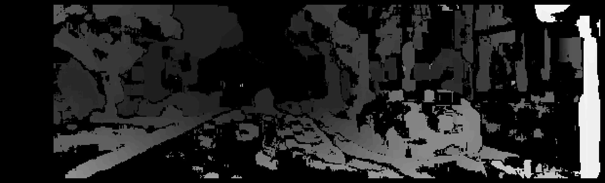

# Vision Algorithms for Mobile Robotics

## **🚧 Under Construction 🚧**

C++ implementation of the exercises of the "Vision Algorithm for Mobile Robotics" at ETH Zurich ([The Course Website](http://rpg.ifi.uzh.ch/teaching2020.html)).

If there are any questions, feel free to open an issue in this github repository.

## requirements

- Developed on Ubuntu 20.04
- docker
- [Nvidia docker container runtime](https://docs.nvidia.com/datacenter/cloud-native/container-toolkit/install-guide.html#) and
- Nvidia GPU and latest Nvidia driver compatible with cuda 11.4 (tested with driver 470)
  - I only know how to run a GUI application within docker with NVIDIA GPUs.
  - I have also started to implement the algorithms with CUDA as well.
    - **DISCLAIMER**: I am only learning CUDA, Don't use my coding style as reference just because I work for NVIDIA. I am not doing any CUDA programing at NVIDIA.
- Python 3 and pip
- **NO** MATLAB:
  - The official course is doing all the exercises in MATLAB and since I do not have MATLAB License, I am doing it in C++. The second reason is, **all the jobs in robotics require strong C++ knowledge**, so I am practicing C++.
- The following libraries are used and already installed in the Docker Image:
  - Eigen library for linear algebra.
  - OpenCV and VTK only for reading, writing of image/video files and 2D/3D visualization.

## Usage

We are using docker, We are installing all the requirements inside the docker and run everything inside the docker.

The container has [terminator](https://terminator-gtk3.readthedocs.io/en/latest/) inside which you can open multiple terminals
as tabs or split windows. Read the documentation of the [terminator](https://terminator-gtk3.readthedocs.io/en/latest/) to learn short keys.

`cli.py` is a helper command line tool to build and run docker image.

```sh
# to install the cli.py's dependencies
python -m pip install -r requirements.txt

# to build the docker image
python cli.py build

# or to pull the image from the dockerhub
# instead of building it,
# It can be faster than building,
# Compiling opencv can take a long time.
python cli.py pull

# to run the docker image and have a terminal inside the docker image, we compile everything in the container
# It will pull my image if you do not build it yourself.
python cli.py run
```

## Compile

```bash
cv VAMR
mkdir -p output/ex{01..09}
python cli.py run # this should start the container
# now inside the container
cd exercises
mkdir build
cd build
cmake ..
make -j`nproc`
```

## Exercises

### Directory Structure

Exercise statements can be found at `exercises/statements/<Exercise directory>/statement.pdf`.
For example, for exercise 1 the file is at `exercises/statements/Exercise 2 - PnP/statement.pdf`.

The input data is not provided in this repo. You can download them from the course webpage at [here](http://rpg.ifi.uzh.ch/teaching2020.html) under section "Course Program, Slides, and Additional Reading Material". They should placed in `data/exXX/`. For example, the
`images` directory for exercies 1 should be placed at `data/ex01/images`. You can also check the exercise main file where the
main file expect to see the input files.

The main function of each exercise file is implemented in `exercises/exerciseXX.cpp` for example the main file for
exercise 1 is `exercises/exercise01.cpp`. Usually the algorithms are implemented as libraries and used with the main file.
You can check the included header files in each `exerciseXX.cpp` to find out the name of the library. The library is implemented
in a directory with the same name of the header file.

The CUDA implementations are using `cuda` as their namespace and they are implemented in `*.cu` and `*.cuh` files.

### Exercise 1 - Augmented Reality Wireframe Cube

This is about camera and distortion models.

- Output Videos:
  - https://youtu.be/RD8uO2pETIE
  - https://youtu.be/Ba9SmGKgBmU


### Exercise 2 - PnP Problem

This exercise is about the PnP (Perspective-n-Point) problem. We basically find the position and orientation of a calibrated camera based on known points in world and their known correspondences in the image frame.

- Problem statement: `exercises/statements/Exercise 2 - PnP/statement.pdf`.
- Solution: `exercises/exercise02.cpp`.
- Output Video:
  - https://youtu.be/nbFseP4vRTU

The following video shows the calculated pose and orientation of the camera relative to the pattern of April Tags.


### Exercise 3 - Simple Keypoint Tracker

- Problem statement: `exercises/statements/Exercise 3 - Simple Keypoint Tracker/statement.pdf`.
- Solution: `exercises/exercise03.cpp`.
- Output Videos:
  - https://youtu.be/8O97v3q7bC4
  - https://youtu.be/T8WX1ktlg8E

Tracking:


The following image shows the Harris and Shi-Tomasi scores, key points and descriptors for the first frame of the dataset.


### Exercise 4 - Simple SIFT Keypoint Detection and Matching

- Problem statement: `exercises/statements/Exercise 4 - simple SIFT/statement.pdf`.
- Solution: `exercises/exercise04.cpp`.

  - :warning: **I guess there are still some bugs in my code** :warning:, but because of
    lack of time and relatively good results, I would go to the next exercise for now. I also skipped the
    optional part of the exercise. I might come back to it later. The descriptor matching could be optimized later.

  

### Exercise 5 - Stereo Dense Reconstruction

- Problem statement: `exercises/statements/Exercise 5 - Stereo Dense Reconstruction`.
- Solution: `exercises/exercise05.cpp`.

  - left first image
    
  - Disparity image from left and right images
    
  - Rough Point Cloud from Disparity

    https://user-images.githubusercontent.com/7648675/144170690-082ce219-87d4-4637-81cf-84824a2f44d5.mp4

  - Point Cloud from Disparity with sub-pixel accuracy

    https://user-images.githubusercontent.com/7648675/144175521-0e370d34-662c-4df6-9901-5bec0fb630fa.mp4

  - complete point cloud from all of the pair of frames (better quality video in `exercises/statements/outputs/ex05-complete_point_cloud.mp4`)

    https://user-images.githubusercontent.com/7648675/144346394-fddc5b30-3640-41db-ae77-8c951ad19c4e.mp4

### Exercise 6 - Two-view Geometry

- Problem statement: `exercises/statements/Exercise 6 - Two-view Geometry`.
- Solution: `exercises/exercise06.cpp`.
- I developed unit tests using Google test framework, similar to the matlab test scripts provided by the exercise in `exercises/tests/test_two_view_geometry.cpp`.
  To execute them after the compilation in the build directory:
  ```bash
  ./tests/two_view_geometry_tests --gtest_filter=Two_View_Geometry.linear_triangulation
  ./tests/two_view_geometry_tests --gtest_filter=Two_View_Geometry.eight_point
  # or the following to run all of the tests for exercise 06.
  ./tests/two_view_geometry_tests
  ```
  - 3D Point cloud and camera poses calculated by 8-Point algorithm from given perfect feature matches (top view)
    

## Useful Commands

```bash
# convert to gif
ffmpeg -ss 0 -t 5 -i input.mp4 -vf "fps=10,scale=320:-1:flags=lanczos,split[s0][s1];[s0]palettegen[p];[s1][p]paletteuse" -loop 0 output.gif

# reduce the size and quality
ffmpeg -i input.mp4 -vcodec libx264 -crf 28 output.mp4
```

### cv::Viz3d Key commands

cv::Viz3d used for 3d visualizations and point cloud visualization. These shortkeys are useful to navigate the view.

```
| Help:
-------
          p, P   : switch to a point-based representation
          w, W   : switch to a wireframe-based representation (where available)
          s, S   : switch to a surface-based representation (where available)

          j, J   : take a .PNG snapshot of the current window view
          k, K   : export scene to Wavefront .obj format
    ALT + k, K   : export scene to VRML format
          c, C   : display current camera/window parameters
          F5     : enable/disable fly mode (changes control style)

          e, E   : exit the interactor
          q, Q   : stop and call VTK's TerminateApp

           +/-   : increment/decrement overall point size
     +/- [+ ALT] : zoom in/out

    r, R [+ ALT] : reset camera [to viewpoint = {0, 0, 0} -> center_{x, y, z}]

    ALT + s, S   : turn stereo mode on/off
    ALT + f, F   : switch between maximized window mode and original size
```
