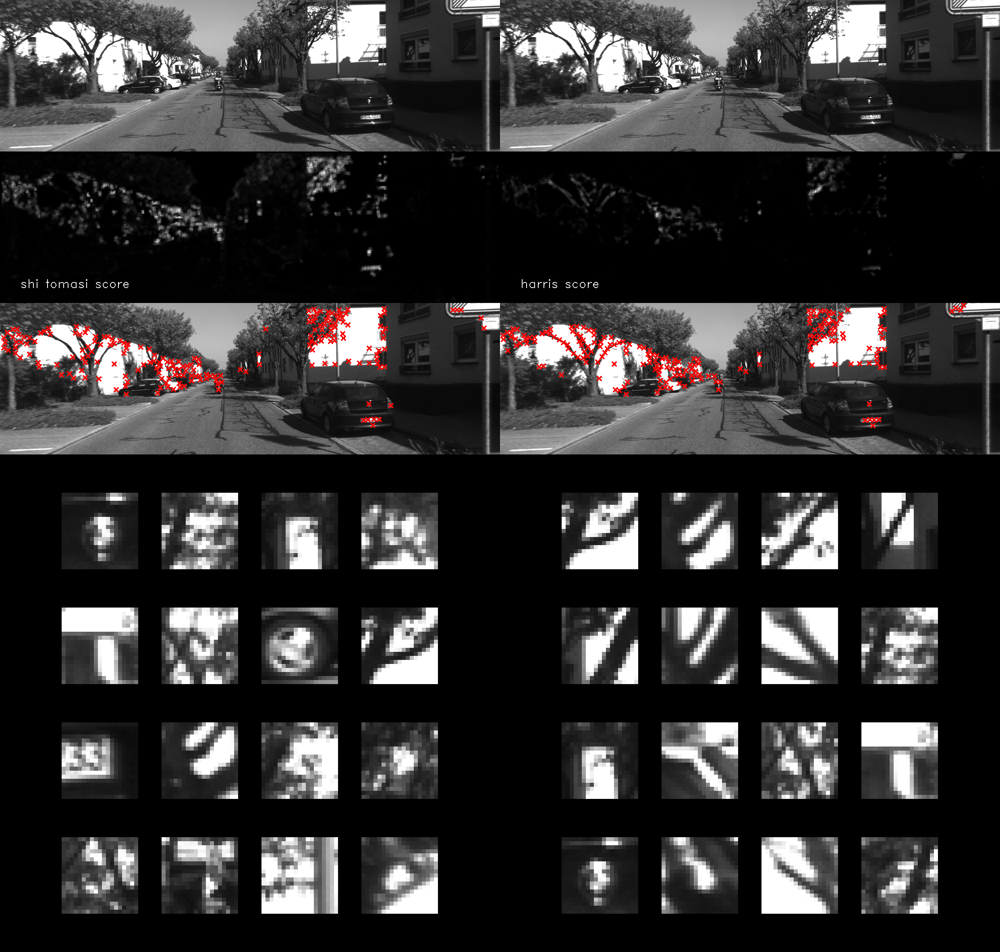

# Vision Algorithms for Mobile Robotics (Fall 2020)

This repository contains all the exercises of the course "Vision Algorithm for Mobile Robotics" in C++.

## Links

[The Course Website](http://rpg.ifi.uzh.ch/teaching2020.html).

## requirements

- Developed on Ubuntu 20.04
- Nvidia GPU
- latest Nvidia driver compatible with cuda 11.4 (tested with driver 470)
- docker
- [Nvidia docker container runtime](https://docs.nvidia.com/datacenter/cloud-native/container-toolkit/install-guide.html#)
- Python 3 and pip
- **NO** MATLAB:
  - The official course is doing all the exercises in MATLAB and since I do not have MATLAB License, I am doing it in C++. The second reason is, **all the jobs in robotics require strong C++ knowledge**, so I am practicing C++.
  The followings are inside the docker image:
    - Using Eigen library for linear algebra.
    - Using OpenCV and VTK only for reading, writing of image and video files and visualization. The rest are coded from scratch.

## Usage

We are using docker, We are installing all the requirements inside the docker and run everything inside the docker.

The container has [terminator](https://terminator-gtk3.readthedocs.io/en/latest/) inside which you can open multiple terminals
as tabs or split windows. Read the documentation of the [terminator](https://terminator-gtk3.readthedocs.io/en/latest/) to learn short keys.

`cli.py` is a helper command line tool to build and run docker image.

```sh
# to install the cli.py's dependencies
python -m pip install -r requirements.txt

# to build the docker image
python cli.py build

# or to pull the image from the dockerhub
# instead of building it,
# It can be faster than building,
# Compiling opencv can take a long time.
python cli.py pull

# to run the docker image and have a terminal inside the docker image, we compile everything in the container
# It will pull my image if you do not build it yourself.
python cli.py run
```

## Compile

```bash
cv VAMR
mkdir -p output/ex{01..09}
python cli.py run
cd exercises
mkdir build
cd build
cmake ..
make -j`nproc`
```

## Exercises

### Exercise 1 - Augmented Reality Wireframe Cube

This is about camera and distortion models.
- Problem statement is in `exercises/statements/Exercise 1 - Augmented Reality Wireframe Cube/statement.pdf`.
- solution is in `exercises/exercise01.cpp`.
- Output Videos:
  - https://youtu.be/RD8uO2pETIE
  - https://youtu.be/Ba9SmGKgBmU


### Exercise 2 - PnP Problem

This exercise is about the PnP (Perspective-n-Point) problem. We basically find the position and orientation of a calibrated camera based on known points in world and their known correspondences in the image frame.
- Problem statement is in `exercises/statements/Exercise 2 - PnP/statement.pdf`.
- Solution is in `exercises/exercise02.cpp`.
- Output Video:
  - https://youtu.be/nbFseP4vRTU

The following video shows the calculated pose and orientation of the camera relative to the pattern of April Tags.


### Exercise 3 - Simple Keypoint Tracker

- Problem statement is in `exercises/statements/Exercise 3 - Simple Keypoint Tracker/statement.pdf`.
- Solution is in `exercises/exercise03.cpp`.
- Output Videos:
  - https://youtu.be/8O97v3q7bC4
  - https://youtu.be/T8WX1ktlg8E

Tracking:


The following image shows the Harris and Shi-Tomasi scores, key points and descriptors for the first frame of the dataset.




## Useful Commands

### Convert to gif

```bash
ffmpeg -ss 0 -t 5 -i input.mp4 -vf "fps=10,scale=320:-1:flags=lanczos,split[s0][s1];[s0]palettegen[p];[s1][p]paletteuse" -loop 0 output.gif
```
